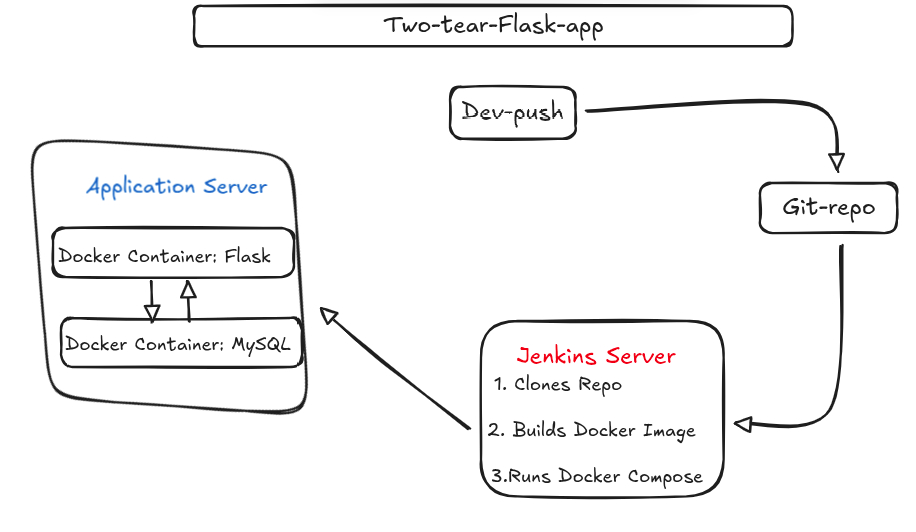
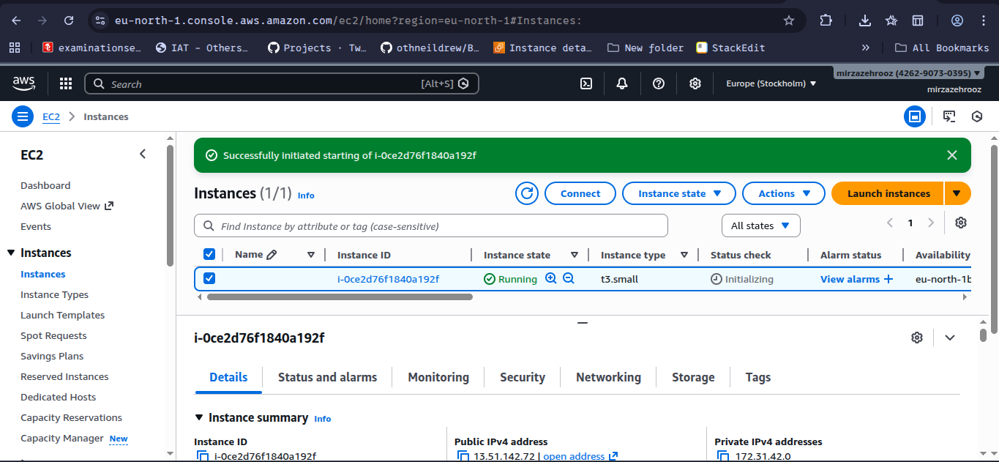
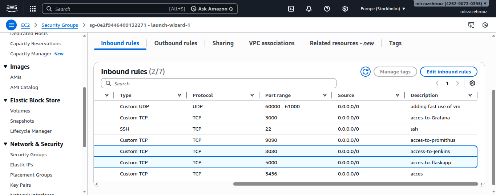
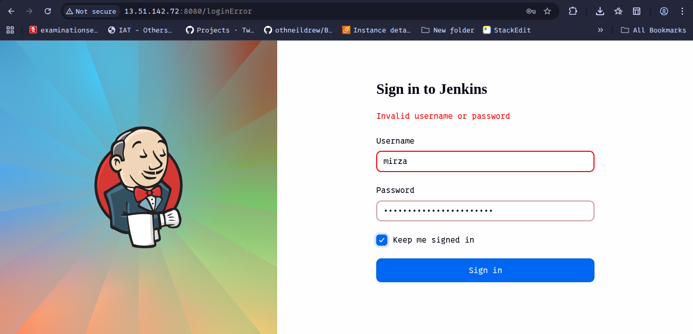
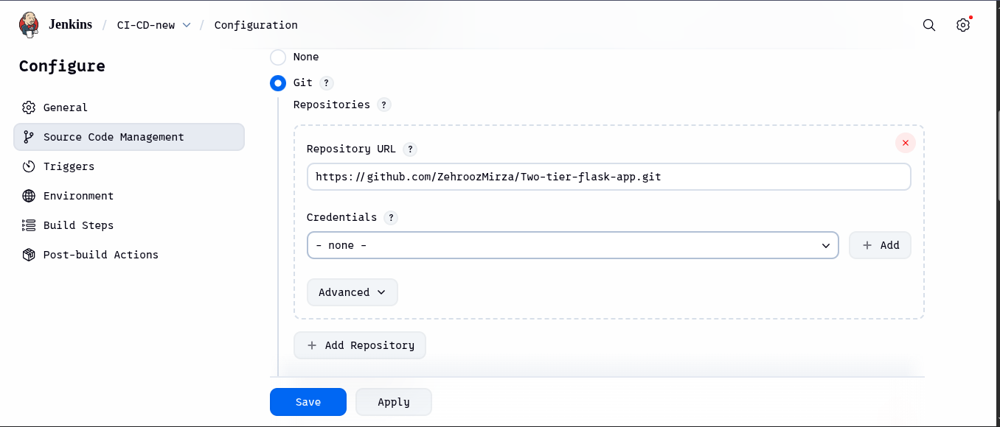
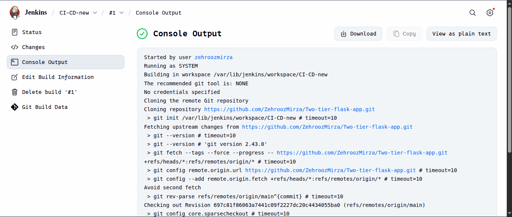
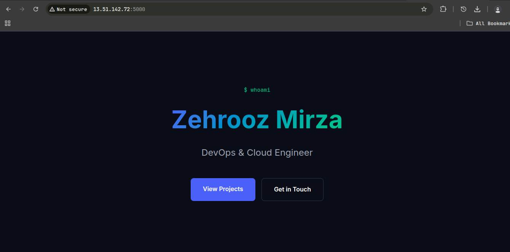
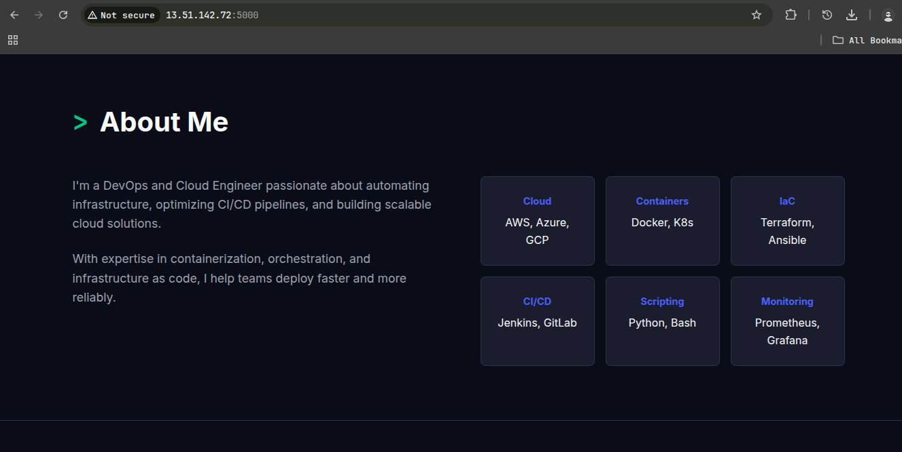

# 🔥 Two-Tier-Flaskapp on AWS

> A containerized 2-tier web application built with Flask and Database, deployed using Docker and automated with Jenkins CI/CD pipeline.

#### By -  Mirza Zehrooz
------

## 1] 📌Overview

In This Document Step by Step process for Deploying a Two-Tier-webapp. That Contain two tier(Flask)<-->(MySQL)
also When Code Pushed To Git Repository. Jenkins Auto Triger  and Start & Build Using Docker and Docker Compose
### Tech Stack ⚙️

- **Backend:** Flask (Python)
    
- **Frontend:** HTML,CSS (Jinja Templates)
    
- **Database:** MySQL
    
- **Containerization:** Docker
    
- **Orchestration:** Docker Compose
    
- **CI/CD:** Jenkins

---

##  2] 🏢Architecture




two-tier-flask-app                                                                                                      
│                                      
├── templates/                 # HTML templates used by Flask (Jinja)                                                      
│   └── index.html             # Main frontend UI page                                           
│                                                              
├── app.py                     # Flask application entry point
│                              # Handles routes and database connection
│
├── requirements.txt           # Python dependencies
│                              # (Flask, mysql-connector, etc.)
│
├── Dockerfile                 # Builds Docker image for Flask app
│
├── docker-compose.yaml        # Multi-container setup
│                              # Runs Flask app + MySQL database
│
├── message.sql                # Database initialization script
│                              # Creates tables and inserts sample data
│
├── Jenkinsfile                # CI/CD pipeline configuration
│                              # Automates build, test and deployment
│
└── README.md                  # Project documentation


### 3) Step 1: Prepare AWS EC2 Instance 🚀

**1️⃣. Open AWS EC2 Console**  
Login to your AWS account and go to the **EC2 dashboard**.

**2️⃣. Launch a New Instance**  
Click on **Launch Instance** to create a new virtual machine.

**3️⃣. Select Operating System**  
Choose **Ubuntu 22.04 LTS AMI** as the operating system.

**4️⃣. Choose Instance Type**  
Select **t2.micro** (eligible for AWS Free Tier).

**5️⃣. Create SSH Key Pair**  
Generate a **new key pair** and download it.  
This key will be used to **connect to the EC2 instance via SSH**.



#### Step 4: 🔐 Configure Security Group🚀
Create a **Security Group** and add these **Inbound Rules** to allow required traffic

**1️⃣ SSH Access**

- **Type:** SSH
- **Protocol:** TCP
- **Port:** 22
- **Source:** Anywhere `0.0.0.0/0`


**2️⃣ Web Traffic (HTTP)**

- **Type:** HTTP
- **Protocol:** TCP
- **Port:** 80
- **Source:** Anywhere `0.0.0.0/0`
 

**3️⃣ Flask Application Port**

- **Type:** Custom TCP
- **Protocol:** TCP
- **Port:** 5000
- **Source:** Anywhere `0.0.0.0/0`


**4️⃣ Jenkins Dashboard**

- **Type:** Custom TCP
- **Protocol:** TCP
- **Port:** 8080
- **Source:** Anywhere `0.0.0.0/0`




5️⃣  Connect to EC2 Instance
  ```shell
   ssh -i /path/to/key.pem ubuntu@<ec2-public-ip>
  ```
  
  Install Dependencies in EC2 Instance

1) Update System Packages
 
  ```bash
  sudo apt update && sudo apt upgrade -y 
  ```

2) Install Docker Compose, Git,and Docker
  ```bash
sudo apt install git docker.io docker-compose-v2 -y
  ```

### 5. Step  Jenkins Installation and Setup

- Run Jenkins container (IMPORTANT PART 🔥) 

```bash
docker run -d -p 8080:8080 -p 50000:50000 \
--name jenkins \
-v jenkins_home:/var/jenkins_home \
-v /var/run/docker.sock:/var/run/docker.sock \
jenkins/jenkins:lts
```

 ```bash
Docker run jenkins
 ```
1. **Initial Jenkins Setup:**
    
 Retrieve the initial admin password:
- ```shell
  sudo cat /var/lib/jenkins/secrets/initialAdminPassword
   ```

 Access the Jenkins dashboard at 
 
##### `http://<VPS-public-ip>:8080`

  - Paste the password, install suggested plugins, and create an admin user.
  - ![[Screenshot_2026-03-13_16-00-39.png]]



## Step 6 GitHub Repository Configuration

Ensure your GitHub repository contains the following three files.

### Jenkinsfile
This file contains the CI/CD definition for Jenkins.
```bash
pipeline {
    agent any

    stages {

        stage('Clone Repo') {
            steps {
                git branch: 'main',
                    url: 'https://github.com/ZehroozMirza/Two-tier-flask-app.git'
            }
        }

        stage('Build & Deploy') {
            steps {
                sh '''
                docker compose down || true
                docker compose build
                docker compose up -d
                '''
            }
        }
    }

    post {
        always {
            sh 'docker system prune -f'
        }
    }
}

```

### docker-compose.yml

This file defines and orchestrates the multi-container application (Flask and MySQL).

```bash
services:
  mysql:
    image: mysql:8.0
    container_name: mysql
    restart: unless-stopped
    environment:
      MYSQL_ROOT_PASSWORD: root
      MYSQL_DATABASE: devops
      MYSQL_USER: app_user
      MYSQL_PASSWORD: app_pass
    volumes:
      - mysql_data:/var/lib/mysql
      - ./message.sql:/docker-entrypoint-initdb.d/message.sql:ro
    networks:
      - app-net

  flask:
    build: .
    container_name: flask-app
    restart: unless-stopped
    depends_on:
      - mysql
    environment:
      MYSQL_HOST: mysql
      MYSQL_USER: app_user
      MYSQL_PASSWORD: app_pass
      MYSQL_DB: devops
    ports:
      - "5000:5000"
    networks:
      - app-net

volumes:
  mysql_data:

networks:
  app-net:
    driver: bridge


```

### Docker File 
This file defines the environment for the Flask application container.

```bash
FROM python:3.9-slim

WORKDIR /app

RUN apt-get update && apt-get install -y \
    gcc \
    default-libmysqlclient-dev \
    pkg-config \
    && rm -rf /var/lib/apt/lists/*

COPY requirements.txt .

RUN pip install --no-cache-dir -r requirements.txt

COPY . .

EXPOSE 5000

CMD ["python", "app.py"]

```

--- 

## Step 7: Jenkins Pipeline Setup & Execution

###  Create Pipeline Job

- Go to Jenkins Dashboard 

- Click **New Item
 
- Enter your project name 
 
- Select **Pipeline** 
 
- Click **OK**


**Set below configs:**

- **Repository URL** → Paste your GitHub repo link

- **Script Path** → `Jenkinsfile` (default, keep same)

- Credentials -> `None`
 


---
###  Finalize

- Click **Save**

- Click **Build Now** to trigger pipeline
  

 
## Step 8 Verify Deployment: 
- After a successful build, your Flask application will be accessible at `http://<your-ec2-public-ip>:5000`.

- Confirm the containers are running on the EC2 instance with `docker ps`


